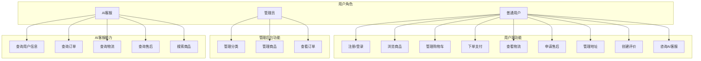
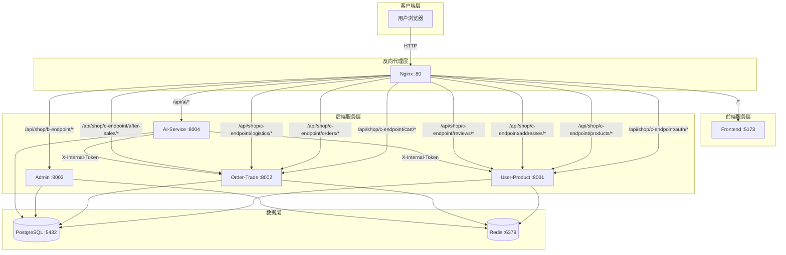
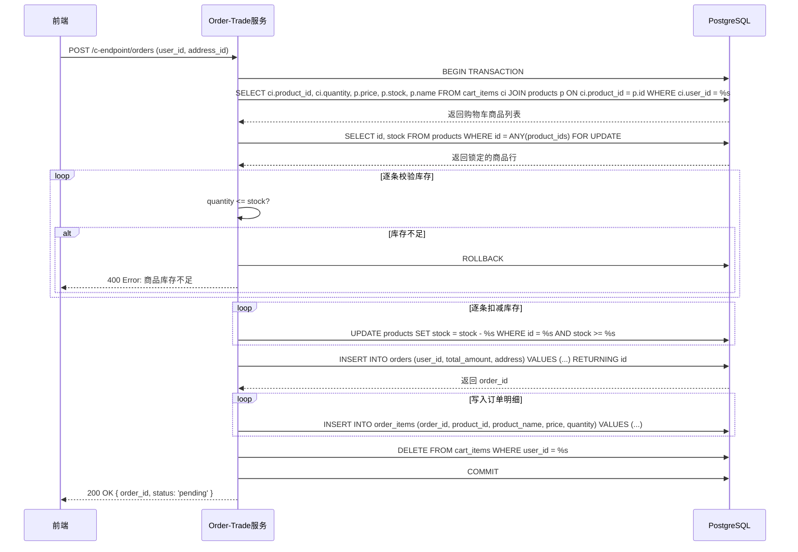
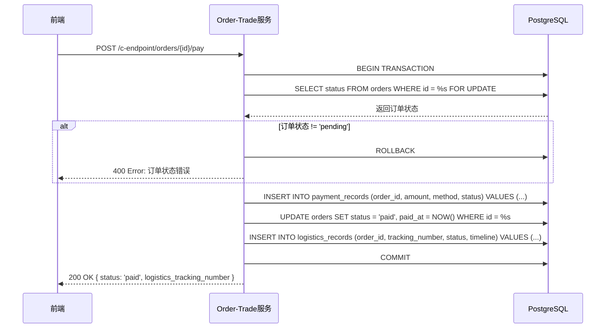
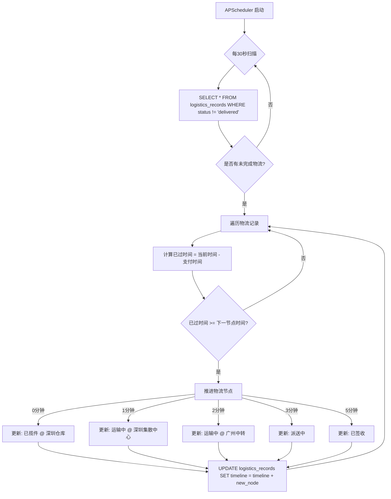
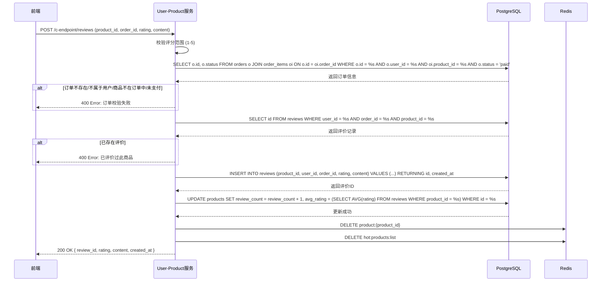
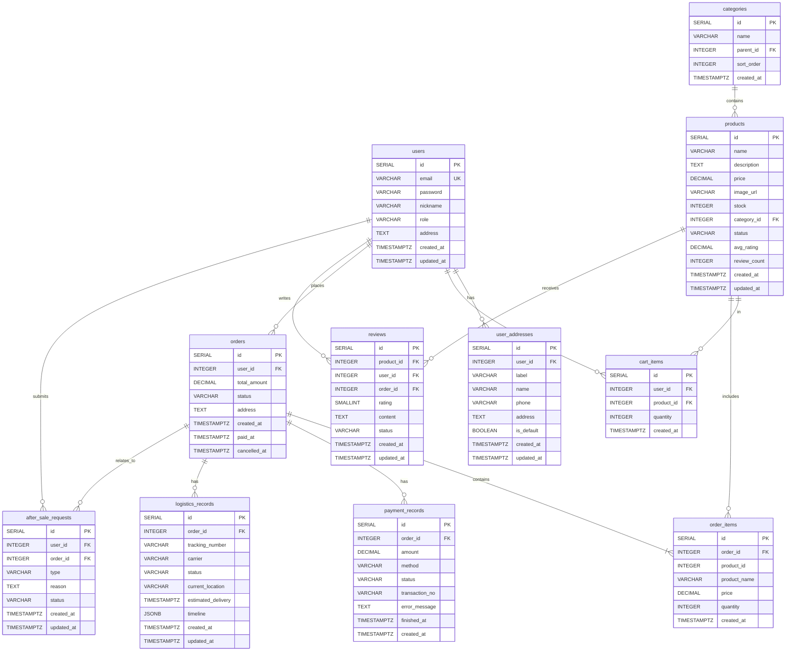
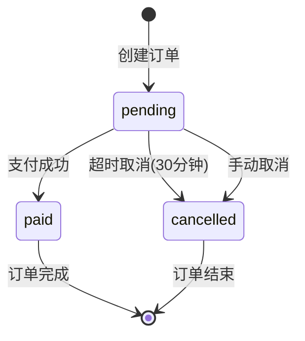
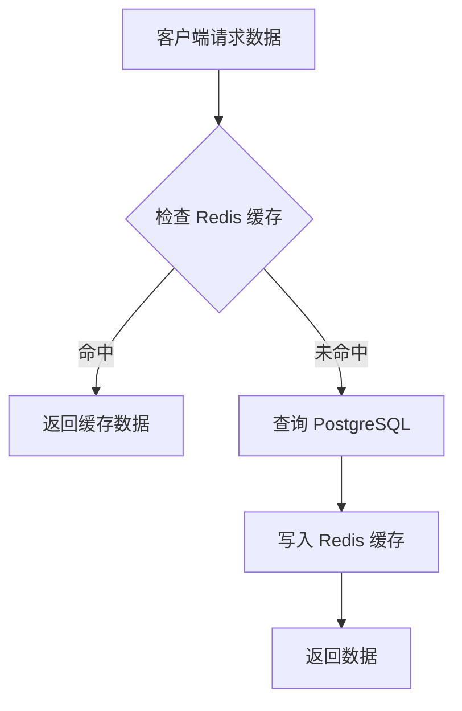

# 电商平台系统设计文档

## 目录

1. [需求分析](#一需求分析)
   - 1.1 项目概述
   - 1.2 功能需求
   - 1.3 非功能需求
   - 1.4 用例图

2. [概要设计](#二概要设计)
   - 2.1 系统架构图
   - 2.2 模块划分
   - 2.3 技术选型说明

3. [详细设计](#三详细设计)
   - 3.1 核心业务流程图
   - 3.2 数据库设计
   - 3.3 缓存策略
   - 3.4 API 接口设计
   - 3.5 内部通信设计

---

## 一、需求分析

### 1.1 项目概述

| 项目 | 说明 |
|------|------|
| **项目名称** | 电商平台 (E-Shop) |
| **项目定位** | 基于微服务架构的轻量级电商平台 Demo |
| **核心价值** | 支持完整的电商购物流程 + AI 智能客服 + 5分钟极速物流模拟 |
| **目标用户** | 普通消费者、平台管理员 |
| **技术特征** | Python FastAPI + React 19 + PostgreSQL + Redis + Docker |

### 1.2 功能需求

#### 1.2.1 用户端（C 端）功能需求

| 序号 | 功能模块 | 功能点 | 功能描述 | 优先级 |
|------|----------|--------|----------|--------|
| 1 | 用户认证 | 用户注册 | 用户通过邮箱和密码注册账号，密码使用 bcrypt 加密存储 | 高 |
| 2 | | 用户登录 | 用户通过邮箱和密码登录，系统签发 JWT Token | 高 |
| 3 | | 个人信息 | 获取当前登录用户的个人信息，支持地址更新 | 中 |
| 4 | 商品浏览 | 商品列表 | 支持分类筛选、关键词搜索、分页查询 | 高 |
| 5 | | 商品详情 | 查看商品详细信息，含评分和评价数量 | 高 |
| 6 | | 热门商品 | 展示热门商品列表，使用 Redis 缓存 | 中 |
| 7 | | 分类树 | 获取二级分类树形结构 | 中 |
| 8 | 购物车 | 添加商品 | 将商品加入购物车，支持数量叠加（UPSERT） | 高 |
| 9 | | 修改数量 | 修改购物车中商品数量，不可超过库存 | 高 |
| 10 | | 删除商品 | 从购物车中删除指定商品 | 高 |
| 11 | | 查看购物车 | 获取当前用户购物车列表 | 高 |
| 12 | 订单管理 | 创建订单 | 基于购物车创建订单，事务锁库存、扣减库存、清空购物车 | 高 |
| 13 | | 订单列表 | 查看当前用户订单列表，支持状态筛选 | 高 |
| 14 | | 订单详情 | 查看订单详细信息，含订单明细 | 高 |
| 15 | | 订单支付 | 模拟支付流程，更新订单状态为已支付 | 高 |
| 16 | | 订单取消 | 取消待支付订单，回滚库存 | 中 |
| 17 | 物流追踪 | 物流查询 | 查询订单物流信息，实时轮询更新 | 中 |
| 18 | | 物流推进 | 支付后自动推进物流节点，5分钟完成 | 高 |
| 19 | 售后管理 | 售后申请 | 已支付订单可申请退款/退货/换货 | 中 |
| 20 | | 售后列表 | 查看当前用户售后申请记录 | 中 |
| 21 | 地址管理 | 地址 CRUD | 支持多地址管理，可设置默认地址 | 中 |
| 22 | 评价系统 | 创建评价 | 已支付订单可对商品进行评价，支持评分和内容 | 中 |
| 23 | | 评价列表 | 查看商品评价列表，支持分页 | 中 |
| 24 | | 评价统计 | 获取商品评分统计（平均评分、星级分布） | 中 |
| 25 | AI 客服 | 智能对话 | 通过 AI 客服查询订单、物流、商品等信息 | 中 |

#### 1.2.2 管理后台（B 端）功能需求

| 序号 | 功能模块 | 功能点 | 功能描述 | 优先级 |
|------|----------|--------|----------|--------|
| 1 | 分类管理 | 分类列表 | 查看全部分类（扁平列表） | 高 |
| 2 | | 创建分类 | 创建一级或二级分类 | 高 |
| 3 | | 编辑分类 | 修改分类信息，更新后清除缓存 | 高 |
| 4 | | 删除分类 | 删除分类，需检查商品引用 | 高 |
| 5 | 商品管理 | 商品列表 | 查看全部商品（含下架商品），支持分类筛选 | 高 |
| 6 | | 发布商品 | 创建新商品，初始状态为上架 | 高 |
| 7 | | 编辑商品 | 修改商品信息，更新后清除缓存 | 高 |
| 8 | | 上下架 | 切换商品上下架状态，清除缓存 | 高 |
| 9 | 订单管理 | 订单列表 | 查看所有用户订单，支持状态筛选 | 中 |
| 10 | | 订单详情 | 查看订单详细信息（只读） | 中 |

### 1.3 非功能需求

| 类别 | 需求项 | 描述 | 实现方案 |
|------|--------|------|----------|
| **性能需求** | 商品查询响应时间 | 商品详情查询响应时间 ≤ 100ms | Redis 缓存（Cache-Aside 模式） |
| | 并发处理能力 | 支持 1000+ 用户并发访问 | 微服务架构 + 负载均衡 |
| | 物流实时性 | 物流状态更新延迟 ≤ 15s | 前端 15s 轮询 + 后端 30s 扫描 |
| **安全需求** | 用户认证 | 无状态认证，Token 有效期合理 | JWT Token |
| | 密码安全 | 密码不可明文存储 | bcrypt 加密 |
| | 权限控制 | 管理后台仅管理员可访问 | role=admin 角色校验 |
| | 内部通信安全 | 服务间通信需身份验证 | X-Internal-Token 令牌校验 |
| **可靠性需求** | 数据一致性 | 下单流程保证原子性 | PostgreSQL 事务 + FOR UPDATE |
| | 防超卖 | 并发下单时库存不出现负数 | FOR UPDATE 行级锁 |
| | 超时处理 | 待支付订单超时自动取消 | APScheduler 定时任务 |
| **可维护性需求** | 代码可扩展性 | 新增功能不影响现有模块 | 微服务拆分 + 接口标准化 |
| | 日志可追踪 | 关键操作有日志记录 | 结构化日志 |
| | 统一响应格式 | 所有接口返回统一格式 | 共享工具函数 |

### 1.4 用例图



---

## 二、概要设计

### 2.1 系统架构图



### 2.2 模块划分

| 服务名称 | 目录 | 端口 | 负责人 | 核心职责 |
|----------|------|------|--------|----------|
| **用户与商品服务** | service-user-product/ | 8001 | 小B | 用户认证、商品管理、地址管理、评价系统 |
| **购物车与交易服务** | service-order-trade/ | 8002 | 小C | 购物车、订单、支付、物流、售后、定时任务 |
| **管理后台服务** | service-admin/ | 8003 | 小D | 分类管理、商品管理、订单查看、缓存失效 |
| **AI 客服服务** | ai-service/ | 8004 | 小A | LLM 对话、工具调用、上下文管理、向量检索 |
| **前端服务** | frontend/ | 5173 | 小A | C 端页面、B 端管理后台、状态管理 |
| **共享库** | shared/ | — | 框架 | 数据库连接、Redis 操作、JWT 工具、统一响应 |

#### 2.2.1 用户与商品服务模块结构

```
service-user-product/
├── main.py                    # FastAPI 入口
├── routers/
│   ├── auth_router.py         # 认证接口（注册/登录/个人信息）
│   ├── product_router.py      # 商品接口（列表/详情/热门/分类树）
│   ├── address_router.py      # 地址管理接口
│   ├── review_router.py       # 评价接口
│   └── internal_router.py     # 内部接口
└── services/
    ├── user_service.py        # 用户业务逻辑
    ├── product_service.py     # 商品业务逻辑
    ├── category_service.py    # 分类业务逻辑
    └── review_service.py      # 评价业务逻辑
```

#### 2.2.2 购物车与交易服务模块结构

```
service-order-trade/
├── main.py                    # FastAPI 入口
├── routers/
│   ├── cart_router.py         # 购物车接口
│   ├── order_router.py        # 订单接口（创建/支付/取消）
│   ├── logistics_router.py    # 物流接口
│   ├── after_sale_router.py   # 售后接口
│   └── internal_router.py     # 内部接口
└── services/
    ├── cart_service.py        # 购物车业务逻辑
    ├── order_service.py       # 订单业务逻辑（核心）
    ├── logistics_service.py   # 物流业务逻辑
    ├── after_sale_service.py  # 售后业务逻辑
    └── scheduler_jobs.py      # 定时任务（超时取消）
```

#### 2.2.3 管理后台服务模块结构

```
service-admin/
├── main.py                    # FastAPI 入口
├── routers/
│   ├── category_router.py     # 分类管理接口
│   ├── product_router.py      # 商品管理接口
│   └── order_router.py        # 订单查看接口
└── services/
    ├── category_service.py    # 分类业务逻辑
    ├── product_service.py     # 商品业务逻辑
    └── order_service.py       # 订单业务逻辑
```

#### 2.2.4 AI 客服服务模块结构

```
ai-service/
├── main.py                    # FastAPI 入口
├── clients/                   # 内部服务客户端
├── tools/                     # 工具定义（Function Calling）
├── chains/                    # LLM 对话链
└── services/                  # AI 业务逻辑
```

### 2.3 技术选型说明

| 层级 | 技术 | 版本 | 选型理由 |
|------|------|------|----------|
| **后端框架** | Python FastAPI | 0.115 | 高性能、类型提示、自动 API 文档、异步支持、轻量级 |
| **前端框架** | React 19 + TypeScript | 19/6 | 组件化开发、类型安全、生态成熟、社区活跃 |
| **构建工具** | Vite | 6 | 快速热更新、ESModule 原生支持、插件系统 |
| **数据库** | PostgreSQL | 16 | 关系型数据库、事务支持、JSONB 类型、社区成熟 |
| **向量检索** | pgvector | — | 集成到 PostgreSQL，支持向量相似度搜索 |
| **缓存** | Redis | 7 | 高性能缓存、支持 JSON、过期策略、分布式锁 |
| **反向代理** | Nginx | latest | 统一入口、负载均衡、静态资源服务、SSL 终止 |
| **容器化** | Docker Compose | — | 环境一致性、快速部署、多容器编排 |
| **LLM 框架** | LangChain | — | 工具调用、多轮对话、函数调用能力、生态完善 |
| **任务调度** | APScheduler | 3.11 | 轻量级、支持定时任务、易于集成到 FastAPI |
| **认证方案** | JWT + bcrypt | — | 无状态认证、密码安全、易于扩展 |

---

## 三、详细设计

### 3.1 核心业务流程图

#### 3.1.1 下单流程（核心）



#### 3.1.2 支付流程



#### 3.1.3 物流推进流程



#### 3.1.4 创建评价流程



### 3.2 数据库设计

#### 3.2.1 ER 图



#### 3.2.2 表结构详细说明

##### 3.2.2.1 shop.users（用户表）

| 字段名 | 数据类型 | 约束 | 说明 |
|--------|----------|------|------|
| id | SERIAL | PRIMARY KEY | 用户唯一标识 |
| email | VARCHAR(255) | UNIQUE NOT NULL | 用户邮箱，用于登录 |
| password | VARCHAR(255) | NOT NULL | bcrypt 加密后的密码 |
| nickname | VARCHAR(100) | — | 用户昵称 |
| role | VARCHAR(20) | DEFAULT 'user' | 用户角色：user/admin |
| address | TEXT | — | 默认地址（冗余字段） |
| created_at | TIMESTAMPTZ | DEFAULT NOW() | 创建时间 |
| updated_at | TIMESTAMPTZ | DEFAULT NOW() | 更新时间 |

**索引**：
- PRIMARY KEY (id)
- UNIQUE (email)

##### 3.2.2.2 shop.products（商品表）

| 字段名 | 数据类型 | 约束 | 说明 |
|--------|----------|------|------|
| id | SERIAL | PRIMARY KEY | 商品唯一标识 |
| name | VARCHAR(255) | NOT NULL | 商品名称 |
| description | TEXT | — | 商品描述 |
| price | DECIMAL(10,2) | NOT NULL | 商品价格 |
| image_url | VARCHAR(500) | — | 商品图片 URL |
| stock | INTEGER | NOT NULL DEFAULT 0 CHECK(stock >= 0) | 商品库存 |
| category_id | INTEGER | NOT NULL REFERENCES categories(id) | 所属分类 ID |
| status | VARCHAR(20) | DEFAULT 'on_sale' | 商品状态：on_sale/off_sale |
| avg_rating | DECIMAL(3,2) | DEFAULT 0 | 平均评分（0-5） |
| review_count | INTEGER | DEFAULT 0 | 评价数量 |
| created_at | TIMESTAMPTZ | DEFAULT NOW() | 创建时间 |
| updated_at | TIMESTAMPTZ | DEFAULT NOW() | 更新时间 |

**索引**：
- PRIMARY KEY (id)
- idx_products_category (category_id)
- idx_products_status (status)

##### 3.2.2.3 shop.orders（订单表）

| 字段名 | 数据类型 | 约束 | 说明 |
|--------|----------|------|------|
| id | SERIAL | PRIMARY KEY | 订单唯一标识 |
| user_id | INTEGER | NOT NULL REFERENCES users(id) | 下单用户 ID |
| total_amount | DECIMAL(10,2) | NOT NULL | 订单总金额 |
| status | VARCHAR(20) | DEFAULT 'pending' | 订单状态：pending/paid/cancelled |
| address | TEXT | NOT NULL | 收货地址（快照） |
| created_at | TIMESTAMPTZ | DEFAULT NOW() | 创建时间 |
| paid_at | TIMESTAMPTZ | — | 支付时间 |
| cancelled_at | TIMESTAMPTZ | — | 取消时间 |

**索引**：
- PRIMARY KEY (id)
- idx_orders_user (user_id)
- idx_orders_status (status)
- idx_orders_pending_time (created_at) WHERE status = 'pending'

##### 3.2.2.4 shop.reviews（评价表）

| 字段名 | 数据类型 | 约束 | 说明 |
|--------|----------|------|------|
| id | SERIAL | PRIMARY KEY | 评价唯一标识 |
| product_id | INTEGER | NOT NULL REFERENCES products(id) | 被评价商品 ID |
| user_id | INTEGER | NOT NULL REFERENCES users(id) | 评价用户 ID |
| order_id | INTEGER | NOT NULL REFERENCES orders(id) | 关联订单 ID |
| rating | SMALLINT | NOT NULL CHECK(rating >= 1 AND rating <= 5) | 评分（1-5星） |
| content | TEXT | DEFAULT '' | 评价内容 |
| status | VARCHAR(20) | DEFAULT 'visible' | 评价状态：visible/hidden |
| created_at | TIMESTAMPTZ | DEFAULT NOW() | 创建时间 |
| updated_at | TIMESTAMPTZ | DEFAULT NOW() | 更新时间 |

**索引**：
- PRIMARY KEY (id)
- UNIQUE (user_id, order_id, product_id)
- idx_reviews_product (product_id, created_at DESC)
- idx_reviews_user (user_id)

##### 3.2.2.5 shop.logistics_records（物流记录表）

| 字段名 | 数据类型 | 约束 | 说明 |
|--------|----------|------|------|
| id | SERIAL | PRIMARY KEY | 物流记录唯一标识 |
| order_id | INTEGER | NOT NULL REFERENCES orders(id) | 关联订单 ID |
| tracking_number | VARCHAR(100) | NOT NULL | 物流单号 |
| carrier | VARCHAR(50) | DEFAULT 'SF-Express' | 物流公司 |
| status | VARCHAR(30) | DEFAULT 'picked_up' | 物流状态 |
| current_location | VARCHAR(255) | — | 当前位置 |
| estimated_delivery | TIMESTAMPTZ | — | 预计送达时间 |
| timeline | JSONB | DEFAULT '[]' | 物流时间线 |
| created_at | TIMESTAMPTZ | DEFAULT NOW() | 创建时间 |
| updated_at | TIMESTAMPTZ | DEFAULT NOW() | 更新时间 |

**索引**：
- PRIMARY KEY (id)
- idx_logistics_order (order_id)

**timeline 字段结构**：
```json
[
    {"time": "2024-01-01 10:00:00", "status": "已揽件", "location": "深圳仓库"},
    {"time": "2024-01-01 11:00:00", "status": "运输中", "location": "深圳集散中心"}
]
```

#### 3.2.3 订单状态机



**状态转换规则**：
| 当前状态 | 目标状态 | 触发条件 | 是否允许 |
|----------|----------|----------|----------|
| pending | paid | 用户支付 | 允许 |
| pending | cancelled | 用户取消或超时 | 允许 |
| paid | cancelled | — | 禁止 |
| cancelled | pending | — | 禁止 |

### 3.3 缓存策略

#### 3.3.1 缓存 Key 设计

| 缓存 Key | 数据内容 | TTL | 更新时机 |
|----------|----------|-----|----------|
| product:{id} | 商品详情 | 600s | 商品编辑/上下架后删除 |
| hot:products:list | 热门商品列表 | 600s | 商品编辑/上下架后删除 |
| categories:tree | 分类树 | 600s | 分类 CRUD 后删除 |
| review:stats:{product_id} | 评价统计 | 300s | 创建评价后更新 |

#### 3.3.2 Cache-Aside 模式流程图



#### 3.3.3 缓存失效策略

| 操作 | 受影响的缓存 Key | 处理方式 |
|------|------------------|----------|
| 创建/编辑/删除分类 | categories:tree | 删除 |
| 发布商品 | hot:products:list | 删除 |
| 编辑商品 | product:{id}, hot:products:list | 删除 |
| 上架/下架商品 | product:{id}, hot:products:list | 删除 |
| 创建评价 | product:{id}, hot:products:list | 删除 |

### 3.4 API 接口设计

#### 3.4.1 用户与商品服务接口

##### C 端接口

| 方法 | 路径 | 说明 | 是否需要认证 |
|------|------|------|--------------|
| POST | /c-endpoint/auth/register | 用户注册 | 否 |
| POST | /c-endpoint/auth/login | 用户登录 | 否 |
| GET | /c-endpoint/auth/me | 获取个人信息 | 是 |
| PUT | /c-endpoint/auth/address | 更新地址 | 是 |
| GET | /c-endpoint/products | 商品列表 | 否 |
| GET | /c-endpoint/products/hot | 热门商品 | 否 |
| GET | /c-endpoint/products/{id} | 商品详情 | 否 |
| GET | /c-endpoint/products/categories/tree | 分类树 | 否 |
| GET | /c-endpoint/addresses | 地址列表 | 是 |
| POST | /c-endpoint/addresses | 创建地址 | 是 |
| PUT | /c-endpoint/addresses/{id} | 更新地址 | 是 |
| DELETE | /c-endpoint/addresses/{id} | 删除地址 | 是 |
| POST | /c-endpoint/reviews | 创建评价 | 是 |
| GET | /c-endpoint/reviews/product/{product_id} | 商品评价列表 | 否 |
| GET | /c-endpoint/reviews/product/{product_id}/stats | 评价统计 | 否 |
| GET | /c-endpoint/reviews | 用户评价列表 | 是 |

##### 内部接口

| 方法 | 路径 | 说明 |
|------|------|------|
| GET | /internal/users/{user_id} | 获取用户信息 |
| GET | /internal/products/search | 商品搜索 |
| GET | /internal/products/{id} | 商品详情 |
| GET | /internal/reviews/product/{product_id} | 商品评价 |
| GET | /internal/reviews/product/{product_id}/stats | 评价统计 |

#### 3.4.2 购物车与交易服务接口

##### C 端接口

| 方法 | 路径 | 说明 | 是否需要认证 |
|------|------|------|--------------|
| GET | /c-endpoint/cart | 查看购物车 | 是 |
| POST | /c-endpoint/cart | 添加购物车 | 是 |
| PUT | /c-endpoint/cart/{product_id} | 修改数量 | 是 |
| DELETE | /c-endpoint/cart/{product_id} | 删除商品 | 是 |
| POST | /c-endpoint/orders | 创建订单 | 是 |
| GET | /c-endpoint/orders | 订单列表 | 是 |
| GET | /c-endpoint/orders/{id} | 订单详情 | 是 |
| POST | /c-endpoint/orders/{id}/pay | 支付订单 | 是 |
| POST | /c-endpoint/orders/{id}/cancel | 取消订单 | 是 |
| GET | /c-endpoint/logistics/{order_id} | 查询物流 | 是 |
| POST | /c-endpoint/after-sales | 申请售后 | 是 |
| GET | /c-endpoint/after-sales | 售后列表 | 是 |

##### 内部接口

| 方法 | 路径 | 说明 |
|------|------|------|
| GET | /internal/orders | 查询用户订单 |
| GET | /internal/orders/{id} | 订单详情 |
| GET | /internal/logistics | 查询物流 |
| GET | /internal/after-sales | 查询售后 |

#### 3.4.3 管理后台服务接口

| 方法 | 路径 | 说明 | 是否需要认证 |
|------|------|------|--------------|
| GET | /b-endpoint/categories | 分类列表 | 是(admin) |
| POST | /b-endpoint/categories | 创建分类 | 是(admin) |
| PUT | /b-endpoint/categories/{id} | 编辑分类 | 是(admin) |
| DELETE | /b-endpoint/categories/{id} | 删除分类 | 是(admin) |
| GET | /b-endpoint/products | 商品列表 | 是(admin) |
| POST | /b-endpoint/products | 发布商品 | 是(admin) |
| PUT | /b-endpoint/products/{id} | 编辑商品 | 是(admin) |
| PATCH | /b-endpoint/products/{id}/status | 上下架 | 是(admin) |
| GET | /b-endpoint/orders | 订单列表 | 是(admin) |
| GET | /b-endpoint/orders/{id} | 订单详情 | 是(admin) |

#### 3.4.4 统一响应格式

```json
{
    "code": 200,
    "message": "success",
    "data": {}
}
```

| 字段 | 类型 | 说明 |
|------|------|------|
| code | INTEGER | 状态码，200 表示成功 |
| message | STRING | 提示信息 |
| data | OBJECT/ARRAY | 业务数据 |

### 3.5 内部通信设计

#### 3.5.1 内部接口认证

AI 服务通过 HTTP 请求调用其他服务的内部接口，使用 `X-Internal-Token` 头进行身份校验。

**认证流程**：
1. AI 服务在请求头中携带 `X-Internal-Token: <token>`
2. 目标服务校验 Token 有效性
3. 校验通过则处理请求，否则返回 403 Forbidden

#### 3.5.2 AI 服务工具调用

AI 服务通过 LangChain 的 Function Calling 能力调用以下工具：

| 工具名称 | 目标服务 | 接口路径 | 说明 |
|----------|----------|----------|------|
| get_user_info | user-product | /internal/users/{user_id} | 获取用户信息 |
| search_products | user-product | /internal/products/search | 搜索商品 |
| get_product_detail | user-product | /internal/products/{id} | 获取商品详情 |
| get_product_reviews | user-product | /internal/reviews/product/{id} | 获取商品评价 |
| get_user_orders | order-trade | /internal/orders | 获取用户订单 |
| get_order_detail | order-trade | /internal/orders/{id} | 获取订单详情 |
| get_logistics | order-trade | /internal/logistics | 获取物流信息 |
| get_after_sales | order-trade | /internal/after-sales | 获取售后信息 |

---

## 四、部署架构

### 4.1 Docker Compose 容器编排

| 容器名称 | 镜像 | 端口 | 说明 |
|----------|------|------|------|
| nginx | nginx:latest | 80 | 反向代理 |
| postgres | postgres:16 | 5432 | 数据库 |
| redis | redis:7 | 6379 | 缓存 |
| user-product | 自定义构建 | 8001 | 用户与商品服务 |
| order-trade | 自定义构建 | 8002 | 购物车与交易服务 |
| admin | 自定义构建 | 8003 | 管理后台服务 |
| ai-service | 自定义构建 | 8004 | AI 客服服务 |
| frontend | 自定义构建 | 5173 | 前端服务 |

### 4.2 启动命令

```bash
# 启动全部服务
docker compose -f docker/docker-compose.yml up -d

# 查看服务状态
docker compose -f docker/docker-compose.yml ps

# 查看日志
docker compose -f docker/docker-compose.yml logs -f <service_name>
```

---

## 五、测试验证

### 5.1 全链路测试

```bash
python tests/integration_test.py
```

### 5.2 测试覆盖模块

| 测试模块 | 测试项数 | 覆盖内容 |
|----------|----------|----------|
| 健康检查 | 4 | 4 个后端服务 |
| 用户认证 | 5 | 注册、重复注册、登录、错误密码、个人信息 |
| 地址管理 | 6 | 创建、列表、默认切换、删除 |
| 商品浏览 | 6 | 列表、搜索、热门、详情、分类树、404 |
| 购物车 | 7 | 添加、叠加、修改、超库存、删除 |
| 订单流程 | 11 | 创建、支付、状态刷新、重复支付、取消、物流、清空 |
| 售后 | 2 | 申请、列表 |
| 权限校验 | 3 | 无 token、无效 token、公开接口 |
| 管理后台 | 9 | 登录、分类、商品、订单、权限 |
| 内部接口 | 8 | 用户、商品、订单、物流、售后、令牌校验 |
| AI 客服 | 2 | 健康检查、对话接口 |

---

**文档版本**：v1.0  
**生成日期**：2026-07-04  
**项目名称**：电商平台 (E-Shop)